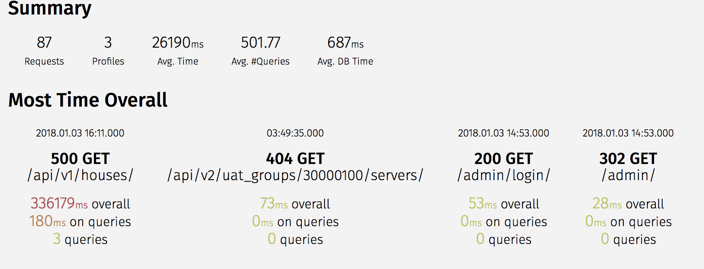

# Performance Optimization For A Web Project

This repo contains initial django project code example in 'master' branch

And optimization code in 'optimise' branch

用 factory-boy 生成10万个房屋的实例

优化主要是两方面：

1 优化数据库查询

        select_related()

        only()

2 优化代码

        自定义序列化

        升级basehash

用 Silk包 做性能分析, silk可以查看请求耗时， 数据库查询耗时， 和数据库查询次数，是很棒的工具

